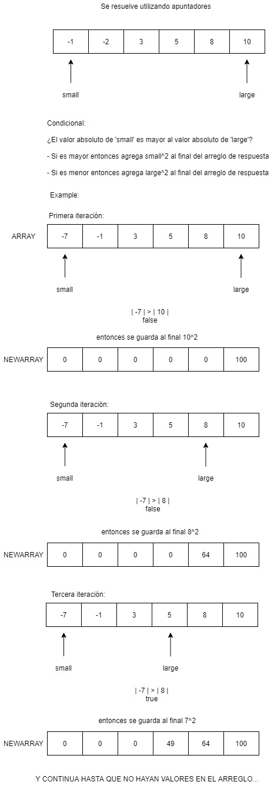

Write a function that takes in a non-empty array of integers that are sorted in ascending order and returns a new array of the same length with the squeres of the original integers also sorted in ascending order

Sample Input
```
array = [ -7, -1, 3, 5, 8, 10 ]
```
Sample Output
```
[ 1, 9, 25, 49, 64, 100 ]
```

solve:



